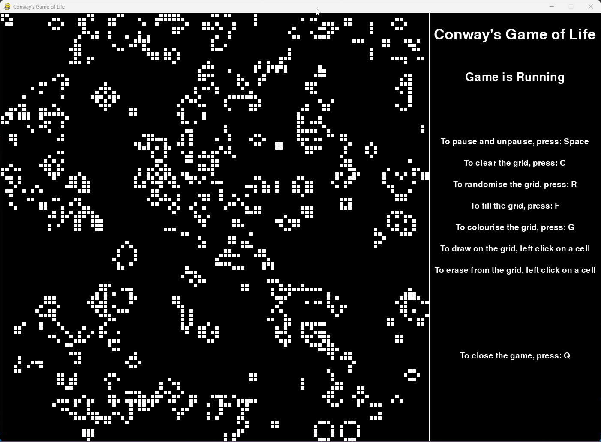
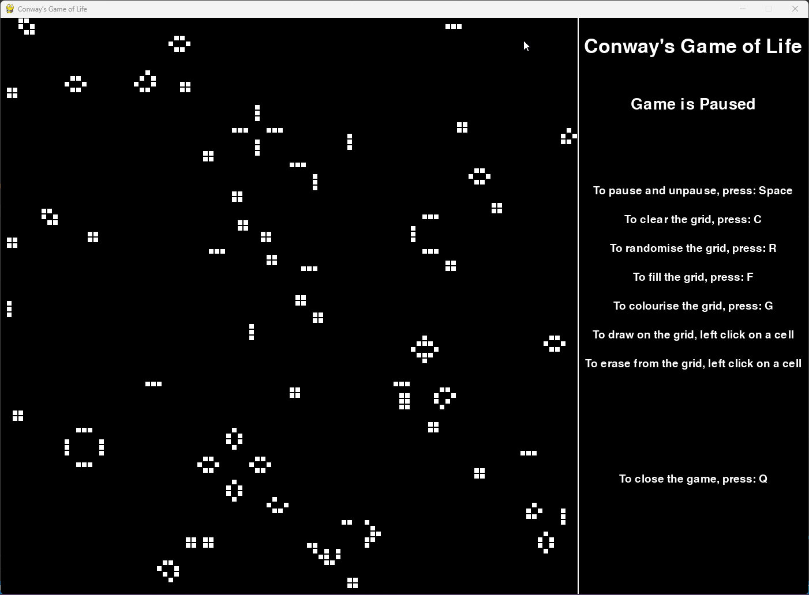

# Conway's Game of Life - An Interactive Cellular Automaton Simulation

---

## Overview

**Conway's Game of Life** is an interactive simulation of the classic cellular automaton designed by John Horton Conway in 1970[^1]. This project implements the game using Pygame, offering users the ability to interact with the grid through various controls and visualize the evolution of patterns in real-time. The project serves as a learning tool for understanding the principles of cellular automata, user interaction, and game development.

The original Game of Life is a zero-player game, meaning that its evolution is determined by its initial state, requiring no further input. However, in this version, you can influence the simulation by drawing and erasing cells, pausing the simulation, and applying various grid manipulations.

---

## Table of Contents

1. [Features](#features)
2. [Installation](#installation)
3. [Usage](#usage)
4. [Customization](#customization)
5. [Usage Gifs](#usage-gifs)
6. [License](#license)
7. [References](#references)

---

## Features

- **Interactive Grid:**
  - Use the mouse to draw and erase cells directly on the grid.
  - Toggle colorization based on cell positions.
- **Keyboard Controls:**
  - **Space:** Pause and resume the simulation.
  - **C:** Clear the entire grid.
  - **R:** Randomize the grid with a new initial state.
  - **F:** Fill the grid with live cells.
  - **G:** Toggle color mode on and off.
  - **Q:** Quit the game.
- **Mouse Controls**:
  - Left-click: Draw on the grid.
  - Right-click: Erase from the grid.
- **Dynamic Cell Colorization:**
  - Cells can be colorized based on their grid position, providing a visually distinct simulation.
- **Real-time Simulation:**
  - The grid is updated in real-time according to Conway's rules, allowing you to observe the emergent behavior of cell patterns.

---

## Installation

To run this project, you will need Python 3.6 or higher and the following Python packages:

- `numpy`
- `pygame`

You can install these dependencies using pip:

```sh
pip install numpy pygame
```

To start the simulation, run the following command:

```sh
python game.py
```

---

## Usage

### Playing the Game:

- The simulation starts with a randomly generated grid. Use the keyboard shortcuts to control the game.
- Left-click to draw live cells and right-click to erase them.
- The simulation follows the standard rules of Conway's Game of Life:
  - Cells with fewer than two or more than three neighbors die.
  - Cells with exactly three neighbors are born.

### Keyboard Shortcuts:

- **Pause/Resume**: Press `Space` to pause and unpause the game.
- **Clear Grid**: Press `C` to clear all cells on the grid.
- **Randomize Grid**: Press `R` to randomize the grid with a new set of live and dead cells.
- **Fill Grid**: Press `F` to fill the grid with live cells.
- **Color Mode**: Press `G` to toggle color mode, which colorizes cells based on their position.
- **Quit**: Press `Q` to exit the game.

---

## Customization

You can customize various aspects of the game, such as:

- **Resolution**: Adjust the `RESOLUTION` variable to change the size of the cells.
- **Window Size**: Adjust the `WIDTH`, `HEIGHT`, and `GAMEWIDTH` variables to change the size of the window
  - You may also need to change the positions of the text fields in order to view them correctly
- **Game Speed**: Modify the `FPS` variable to change the speed of the simulation.
- **Colors**: Customize the colors of the cells in the `get_cell_colour` function.

---

## Usage Gifs





---
## License
---

Feel free to contribute to this project by submitting issues or pull requests. For any questions or further information, please contact the project maintainer.

---

**Notice**: You are free to use, modify, and distribute this code as needed. The author of this project is Lewis Murphy, @defalt0402. If you have any questions or need further clarification, please reach out!

---

## References

[^1]: [Conways Game of Life](https://en.wikipedia.org/wiki/Conway%27s_Game_of_Life): The wikipedia page for Conway's Game of Life.


